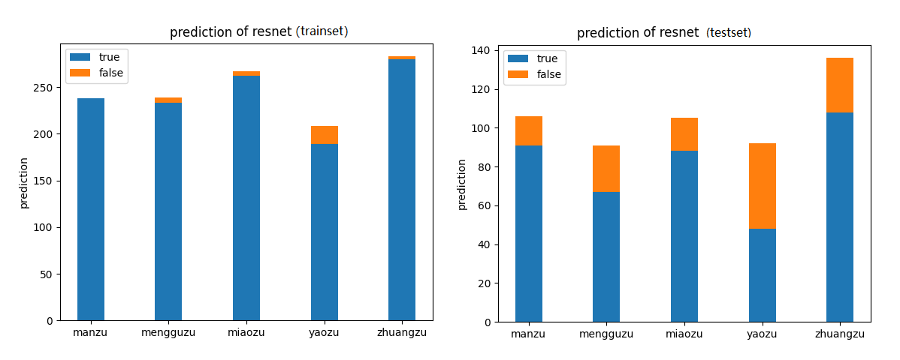

## 数据集增强

增强方法：
1. random_crop： 随机裁剪
2. random_flip： 随机翻转
3. random_rotate：随机旋转
4. random_shelter： 随机遮挡


## 训练测试
### 配置参数
```
CLASSNUMS = 5              # 分类个数
MODEL_FLAG = 1             # 0: 使用原始resnet， 1:使用调整后的resnet
INPUTSIZE = (224, 320)     # 调整后的resnet输入尺寸
BATCHSIZE = 32             # 训练batch参数
EPOCHES = 100              # 训练次数
LEARNING_RATE = 0.0005     # 学习率参数
DROPOUT = 0.0              # dropout参数（0-1）， 为0.0时即不使用dropout
```

### dropout训练


**结论：** 使用dropout会降低模型效果。
### 学习率调整训练


**结论：** lr=0.0005时，训练效果最佳。

### 特征图可视化

从resnet50中选择三个卷积层的特征进行可视化（每个卷积层特征中随机选择30个通道进行绘图）
卷积层：'conv1_conv2', 'conv2_conv2', 'conv4_block2_conv3'

输入图像：


特征图像：


### resnet 最优参数训练与评估
损失与准确率曲线：


### resnet 调整对比

#### 调整部分
1. 将模型输入从224x224调整到224x320（与数据集中的图像比例相适应）；
2. 将resnet最后一个block的每个输出通道由2048减少到1024（减少了模型参数，减轻过拟合）。

训练损失与准确率曲线：


### 最优模型测试结果

训练集准确率：0.9856

测试集准确率：0.7623

混淆矩阵：


预测结果：



### 训练测试耗时

训练用时：不同的学习率以及dropout参数，训练用时基本一致
1. 原版resnet：100个epoch总共约2小时
2. 调整后的resnet：100个epoch总共约2.5小时

单帧测试用时：
1. 原版resnet：0.0324s
2. 调整后的resnet：0.0327s

注：训练和测试的运行设备均为：RTX2080